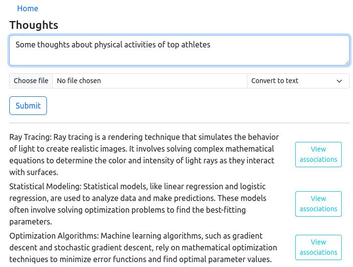
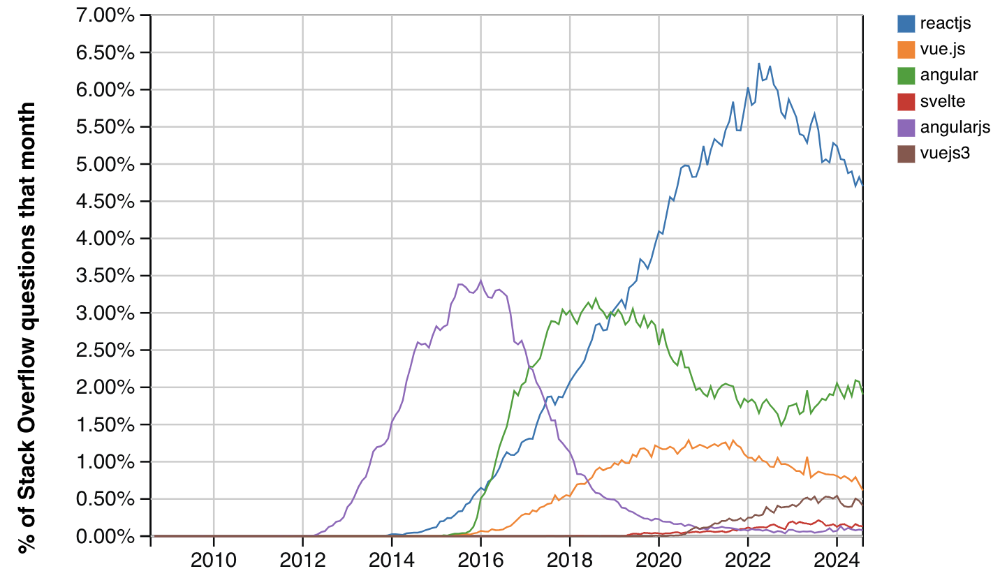

## ThoughtsKeeperOrg 👋

The role of the app is to store and view thoughts (short texts, notes, quotations etc). It can read text from images.

Application is just a small showcase to raise discussion about technologies and tools selection, architectural and design decisions.
Of course, there's a lot to be done to make it work in the real world.


    
Let's imagine that we have application and expecting rapid growth of users in near future. New features are in demand. As a result, the workload will increase significantly.
So the idea is to create project which is easy to maintain and refactor. Onboarding of new developers, task delagation should be fast and painless as much as possible. 
Modular structure of project will help with this. It is easier to understand one module at a time than the entire project at once. Another advantage is: work can be paralelized in not blocking manner among developers. Narrow scope of focus should increase productivity. However, high level perspective and understanding of the whole picture is valuable either. It helps to make better decisions and trade-offs. The knowledge of each individual module must be combined into a single program concept like a puzzle.

### Data flow

One of use scenarios: user uploads photo of page from book via `UI`s [form](form_page.jpg). It is submited to backend'
s [LTM](#long-therm-memory-ltm)'s endpoind. File is persisted and `Kafka` event `textimage_created` produced.
This event is consumed by [OCR](#ocr) service which reads file from data storage and extracts text, publishes `ocr` message with result in payload to the broker.

`LTM` handles this event: saves text to `Postgres` and emits event to the kafka topic `entities_updates`. The topic has two subscribers: [WS server](#ws-server) and [Text Analyzer](#text-analyzer). The first one sends updated entity to `UI` through websocket channel. `UI` handles the message by updating webpage, showing notification, disabling loader, etc.

Meanwhile `Text Analyzer` service is processing updated text by splitting it into tokens for [Bag Of Words](https://en.wikipedia.org/wiki/Bag-of-words_model) (later stored to the `MongoDB`). Created/updated BOW is compared with other BOWs. The result of comparison is float value in range from `0.0` to `1.0`. `0.0` means that two BOWs has nothing in common, `1.0` - its the same text. This coefficient is stored to `Neo4jDB` as a relation between each two entities. `text_analyzed` event is published to kafka(#todo).

Now when user goes to page ["Thought associations"](associations_page.jpg) he can see related thoughts ranged by similarity. `UI` makes request to `LTM` to get content. `LTM`, in its turn, runs `Neo4jDB`'s query for similarity coefficients and `Postgres` for texts.

Data flow for described case can be visualized as:
```
UI -> LTM -> OCR -> LTM -> PostrgeSQL
                        -> Text Analyzer -> mongo, neo4j 
                        -> WS_server     -> UI
```

### Repositories

- [UI](#ui)                  
- [Long therm memory (LTM)](#long-therm-memory-ltm)                  
- [OCR](#ocr)                  
- [Text Analyzer](#text-analyzer)                  
- [WS server](#ws-server)                  
- [OPS](#ops)

Next is the description of each service from repositeries and few words about decisions were made.               


### [UI](https://github.com/ThoughtsKeeperOrg/ui)

<p style="float:left">


</p>
<p style="clear: both;"></p>


React + Bootsrap app which handles user`s input and submits form to BE(service LTM). Also it renders previously saved thoughts. 
UI comunicates with backend services via REST api (TODO: migrate to graphql) and websockets.

##### Full stack web framework vs standlone ui layer

If back end(BE) is client agnostic: front end(FE) is an abstract thing, its just an entity which uses API. It can be web page, mobile app or a desktop program. Major advantages of decoupling FE and BE are:

- possibility to have many FE implementations
- only one BE`s entry point to manage
- BE scaling becomes more straight forward
- two small sets(FE,BE) of dependecies is easier to manage than huge one
- possibility to deploy FE to CDN to improve load speed

Cons are:

- deploy becomes more complicated
- backward compatibility can be a risc and should be handled with care
- more operational overhead

##### Why JS framework?

Simple solutions are great. I would like to make UI apps as simple as one index.html and maybe one css file. But then i need to add dynamic features to the page and js happens. Then i want to reuse some well designed and tested plugin. It has dependencies which must be managed. What if i need to include few more libraries? How to handle all of this? How to reduce size of all assets to make page loading faster? How to write unit tests? Modern framework can help. Which one to choose? Since the UI has no specific requirements lets rely on google and the wisdom of the crowd. Search query "js framework popularity chart" in most cases shows something like this: 



So React then. Ok. As a bonus we get jsx, components, state, props, industry tested approches and conventions, many examples in the web and other useful tools. Now its possible to write complex structured business logic on the front end. It can save some server time. Let's hope all new developers will read framework`s manual and have faith in SOLID. 
 
##### Why graphql?

When UI uses several BE endpoints to gather data for rendering its a sign that optimization can be made. One of aproaches is to create new BE endpoint which returns all required data. But then the segregation of concepts is broken. And what if some new types of data will be requested soon? Extend existing endpoint? Create another one? Anyway it leads to bloating. So looks like GraphQL is good solution. But it comes with the price: it is additional dependency, learning takes some time. Its not that simple as REST api. Its one more line to the vacancy requirements. 


### [Long therm memory (LTM)](https://github.com/ThoughtsKeeperOrg/long_term_memory)
It serves as backend layer which handles request from UI, stores received data and files, coordinates work of other backend services by communication via kafka messages. 

Think of it as a state machine. Main entity of the service is `Thought`. `LTM` orchestrates all tasks related to it: data peristance and analysis, searching and filtering. It knows everything whats happening with `Thought`. So it is a good point to add data auditing and logging of changes (#todo). 

Since processing of `Thought` involves asynchronous execution of other services [saga pattern](https://docs.aws.amazon.com/prescriptive-guidance/latest/cloud-design-patterns/saga.html) can be implemented (#todo).

`LTM` can be used as API server or events consumer. 

API role involves handling of uploaded files. This process can be greedy to memory. Also `LTM` is a gateway exposed to outer world so strict security rules can be applied. Internal consumer role presumes work only with data which already are inside security perimeter. No other impactful differences for now.
Maybe later `LTM` can be refactored into two services: one for api and other for consuming events. But for now lets keep it as on piece since both roles requires the same entities and libraries. Clear boundary how to divide them is not seen at the moment. Not a bad idea is to postpone this decision to the future if it will be necessary.

It is possible to spinup both roles as standalone instances. Should be easier to manage from devops point of view. More effectively address questions of high availability and fault tolerance. "Divide and rule," as the ancient Greeks said. 

In this way, for example, API keeps accepting new inputs of users even if consumer is busy and has huge queue to process. Or if api instance fail for some reason, consumer keeps working.

##### Why Ruby on Rails?

Because ROR allows to produce prototypes realy fast. Readabily of language is amazing. It has a lot of "gems". If you need some function for your web app - most likely, ruby world already have it, with well written documentation and manuals. Ruby has easy to use clients to integrate with almost everything(databases, services, libraries), minimum boilerplate code. To sum up: "it feels good".

"Ruby is slow" you may say. Perhaps. If performance is a really an issue then slow part of code can be extracted to microservice and rewriten in language which fits better for the problem. This is exactly the reason why [Text Analyzer](#text-analyzer) service exists.

Other argument for "not ruby" approach is if good solution already exist in other language. For example: analytical tools of python or all kinds of binaries of C.
Well, in that case is hard to find counterarguments. And example is [OCR](#ocr) service which uses [tesseract](https://github.com/tesseract-ocr/tesseract).


### [OCR](https://github.com/ThoughtsKeeperOrg/ocr)

Reads texts from images. Uses [tesseract](https://github.com/tesseract-ocr/tesseract) as OCR engine.

It is subscribed to `textimage_created` kafka topic. After image processing it publishes message with scraped text to the `ocr` topic.

Ruby is thin layer between kafka and tesseract. It is used only because the same client already has been used in `LTM`. There is no need to use anything else. Less dependencies - less maintenance burden.

High consumption of resources is one of reasons why the service exists as microservice. It can be easily scaled horizontally.

`tesseract` can be replaced with any other library or cloud solution without any modification of other services.


### [Text analyzer](https://github.com/ThoughtsKeeperOrg/text_analyzer)

The service consumes kafka event and analyzes text from payload. It stores created [Bag Of Words](https://en.wikipedia.org/wiki/Bag-of-words_model) in `Mongodb`. Compares the BOW with all other documents and computes similarity between texts. Saves similarity estimation to `neo4j`.

##### Why not use an existing library?

`ElasticSearch` has little bit similar functionality. But it sounds like overkill to use it for only one small method which does not match with requirements for 100%. It takes more time to deep dive into `ElasticSearch`s documentation and code tailoring than craft simple tiny solution which requires no payments for license.

##### Why rust?

Rust is known for its high performance, comparable to C and C++, thanks to its efficient memory management and low-level control over hardware. The language has modern ecosystem and tools which makes it easy to use. Rust provides built-in support for concurrency with features like threads and asynchronous programming, ensuring safe parallelism without data races. No garbage collection. Unlike some programming languages, Rust does not employ garbage collection. Instead, its ownership and borrowing rules manage memory, which helps empower developers to have precise control over memory allocation and deallocation for efficient resource management.

##### Why MongoDB?

Actually it looks like a bad decision. Initial thoughts were: "It uses a JSON-like format to store documents, which fits well BOW objects, no additional mapping required. Advantages of SQL is not necessary, there will be no aggregation, joins, complex selects. Only inserts, get by id and get all paginated.". But many benchmarks ([example](https://info.enterprisedb.com/rs/069-ALB-339/images/PostgreSQL_MongoDB_Benchmark-WhitepaperFinal.pdf)) has proved that `PostgreSQL` has better performance for storing json anyway. Why then additional underperforming dependency introduced?

There are a lot other NoSQL databases worth to consider, like Cassandra, CouchDB, WordNet, DynamoDB(if AWS stack) or PostgreSQL with json column.

Let `MongoDB` dangle here for now, like a stub, until better solution is chosen.

##### Why Neo4j?

Because its graph database. And graph is the best representation of thoughts and associations. Every thought is related to other in some extent, if not directly then through some connection. Abstraction of nodes and edges is very suitable for this idea. `Neo4j` and `cypher` query language makes searching in graph by pattern a primitive task. It opens powerful analytical opportunities.


### [WS server](https://github.com/ThoughtsKeeperOrg/ws_server)

Websockets server for handling FE - BE connection. It is only data transfer layer, no additional logic. It listens to specific kafka events which are transmitted to `UI`.

##### Why elixir? 

First released in 2011 – it’s taken until 2024 for it to rise to be the second-most desired programming language to learn according to the 65,000 respondents, behind only Rust.

Elixir runs on the Erlang virtual machine – a foundation that gives it some significant advantages. Erlang was developed for telecommunication systems, and specifically designed to handle concurrent, distributed, and fault-tolerant systems – precisely the kind of challenges faced by modern web applications.

Major plus point for Elixir is its built-in fault tolerance and automatic restarts, which smooth over issues for developers working with it, often without any noticeable interruption to the end user.

There are stories in the web about reducing server count up to 30 times thanks to Elixir.

Sounds like perfect fit for websocket protocol. Isn't it?


### [OPS](https://github.com/ThoughtsKeeperOrg/ops)
In this repo you can find environment setup and things useful to manage runtime.

Docker helps to spin up local dev environment blazingly fast. No need to install dependencies, updates, switching versions and other things which consumes time. Just type `docker compose up` and everything is done:


Another plus is that team can be sure that all members are using the same versions as on production. It leads to many advanteges. When developer is using stack locally it passively tests integration between components. It helps to discover bugs earlier. Or even more: automated end-to-end testing can be implemented.
